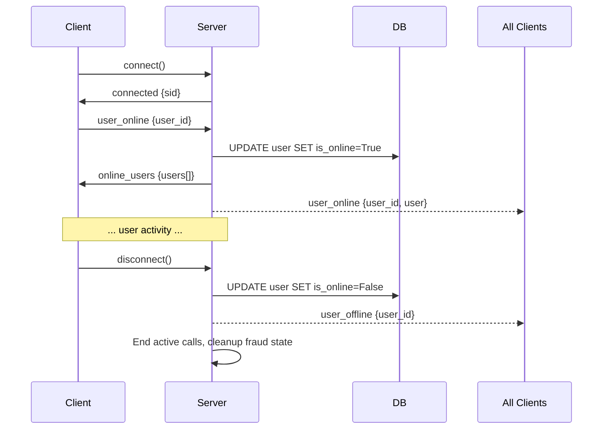
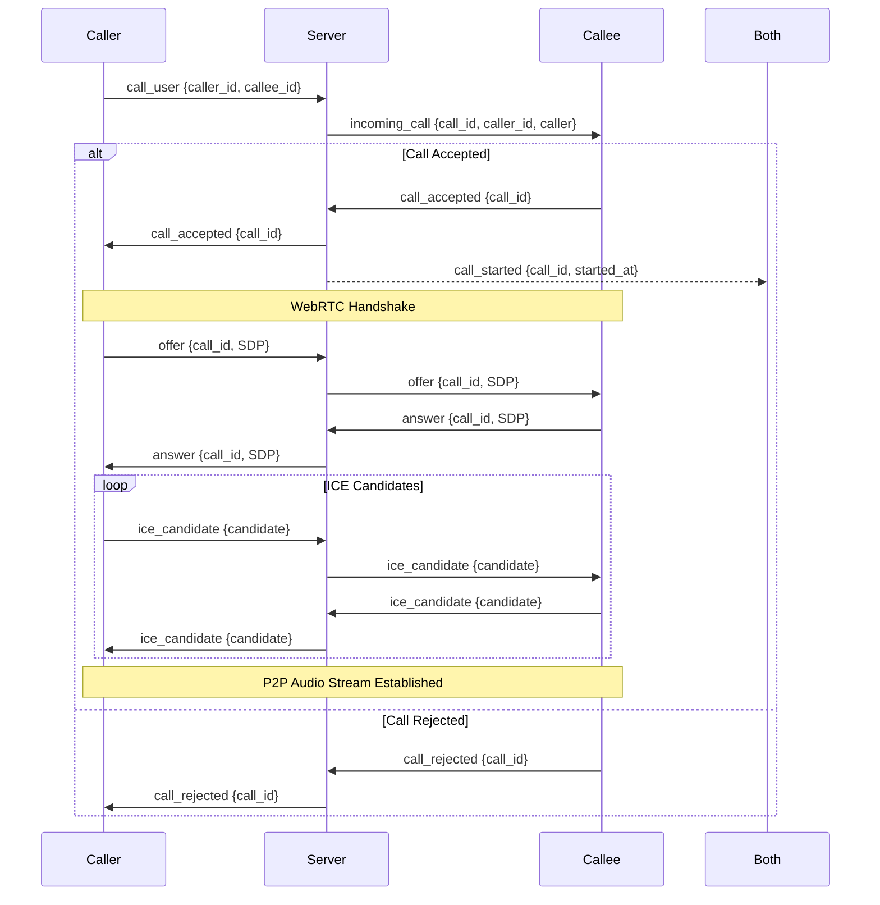
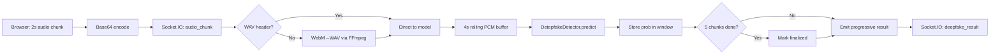

# Audionyx — Comprehensive Technical Analysis for Research Paper

> **Project Title**: Audionyx — Real-time Deepfake Audio Detection System  
> **Domain**: Cybersecurity / Artificial Intelligence / Audio Forensics  
> **Tagline**: *Protecting conversations in the age of AI.*

---

## 1. Abstract & Problem Statement

### 1.1 The Problem

The rapid advancement of generative AI, particularly voice synthesis and voice cloning technologies (e.g., ElevenLabs, VALL-E, Tacotron, WaveNet), has made it possible to replicate a person's voice with high fidelity using only a few seconds of reference audio. This poses severe threats to:

- **Financial fraud**: Attackers impersonate executives or family members in phone calls to authorize money transfers.
- **Identity theft**: Voice-based authentication systems can be bypassed with cloned voices.
- **Social engineering**: Convincing deepfake audio can be used in phishing attacks via VoIP or phone calls.
- **Misinformation**: Fabricated audio recordings attributed to public figures can spread disinformation.

### 1.2 The Solution

**Audionyx** is a full-stack real-time deepfake audio detection system that monitors voice calls as they happen and classifies the incoming audio as **authentic** or **deepfake** using a trained deep learning model. Unlike offline forensic tools, Audionyx operates in real-time during active WebRTC audio calls, providing live fraud probability scores to the call recipient.

### 1.3 Key Contributions

1. A **real-time detection pipeline** that processes live audio streams during active calls, not just pre-recorded files.
2. A **TensorFlow/Keras inference engine** optimized for real-time deepfake detection.
3. A **sliding window analysis** approach with configurable aggregation rules (max-confidence, average-confidence, hysteresis smoothing).
4. A **fraudster simulation mode** for controlled testing without requiring actual deepfake generation tools.
5. A complete **production-ready web application** with authentication, admin panel, and deployment infrastructure.

---

## 2. System Architecture

### 2.1 High-Level Architecture

```mermaid
graph TB
    subgraph Frontend ["Frontend (React + Vite)"]
        UI[User Interface]
        AuthCtx[AuthContext]
        CallCtx[CallContext]
        WebRTC[useWebRTC Hook]
        AudioProc[useAudioProcessing Hook]
        SocketSvc[Socket.io Client]
    end

    subgraph Backend ["Backend (Flask + SocketIO)"]
        API[REST API Routes]
        Auth[Auth Routes]
        Admin[Admin Routes]
        SocketHandler[Socket.IO Handler]
        MLEngine[ML Inference Engine]
        AudioConv[Audio Processor]
        DB[(SQLite Database)]
        Model[ML Model (Keras .h5)]
    end

    UI --> AuthCtx
    UI --> CallCtx
    CallCtx --> WebRTC
    CallCtx --> AudioProc
    CallCtx --> SocketSvc
    SocketSvc <-->|WebSocket| SocketHandler
    AuthCtx --> API
    AuthCtx --> Auth
    SocketHandler --> MLEngine
    SocketHandler --> AudioConv
    MLEngine --> Model
    Auth --> DB
    API --> DB
    Admin --> DB
```

### 2.2 Technology Stack

| Layer | Technology | Version | Purpose |
|-------|-----------|---------|---------|
| **Backend Framework** | Flask | 3.0.0 | HTTP server and REST API |
| **Real-time Communication** | Flask-SocketIO | 5.3.5 | WebSocket-based bidirectional events |
| **Async Runtime** | Eventlet | 0.33.3 | Asynchronous I/O for SocketIO |
| **ML Framework** | TensorFlow/Keras | ≥2.18.0 | Deep learning model inference |
| **Audio Processing** | Librosa | ≥0.10.1 | Feature extraction (Mel, LFCC) |
| **Audio I/O** | SoundFile | ≥0.12.1 | WAV encoding/decoding |
| **Audio Conversion** | PyDub + FFmpeg | ≥0.25.1 | WebM/Opus → WAV conversion |
| **Database** | SQLite via SQLAlchemy | 3.1.1 | User storage and state |
| **Authentication** | Flask-JWT-Extended | 4.5.3 | JSON Web Token auth |
| **Password Hashing** | Flask-Bcrypt | 1.0.1 | Secure password storage |
| **Frontend Framework** | React | 18 | Single-page application |
| **Build Tool** | Vite | 5.4.21 | Dev server with HMR and proxy |
| **WebRTC** | Native Browser API | — | Peer-to-peer audio |
| **Frontend Socket** | socket.io-client | — | Real-time event communication |


### 2.3 Project File Structure

```
Audionyx/
├── backend/
│   ├── app/
│   │   ├── __init__.py              # Flask application factory
│   │   ├── config.py                # Configuration classes
│   │   ├── models/
│   │   │   └── user.py              # SQLAlchemy User model
│   │   ├── routes/
│   │   │   ├── auth.py              # Authentication endpoints
│   │   │   ├── api.py               # API endpoints (users, online status)
│   │   │   └── admin.py             # Admin panel endpoints
│   │   ├── services/
│   │   │   ├── ml_inference.py      # DeepfakeDetector class (840 lines)
│   │   │   ├── socket_handler.py    # Socket.IO event handlers (889 lines)
│   │   │   └── audio_processor.py   # Audio format conversion utilities
│   │   └── static/
│   │       └── fraudster_audio.wav  # Pre-recorded audio for fraudster simulation
│   ├── models/
│   │   └── deepfake_audio_detector_v2.h5  # Active Keras model
│   ├── run.py                       # Entry point

│   └── requirements.txt             # Python dependencies
│
└── frontend/
    ├── src/
    │   ├── App.jsx                  # Root component with routing
    │   ├── config.js                # API URLs, WebRTC, audio settings
    │   ├── main.jsx                 # React DOM root
    │   ├── context/
    │   │   ├── AuthContext.jsx       # Authentication state management
    │   │   └── CallContext.jsx       # Call state + online users + deepfake results
    │   ├── hooks/
    │   │   ├── useWebRTC.js          # WebRTC peer connection management
    │   │   └── useAudioProcessing.js # Audio capture, WAV encoding, streaming
    │   ├── services/
    │   │   ├── auth.js              # Axios HTTP client with JWT interceptors
    │   │   └── socket.js           # Socket.IO client singleton
    │   └── components/
    │       ├── Auth/
    │       │   ├── Login.jsx         # Login form
    │       │   ├── Register.jsx      # Registration form
    │       │   └── Auth.css          # Glassmorphism auth styling
    │       ├── Dashboard/
    │       │   ├── UserDashboard.jsx  # Online users list + call initiation
    │       │   └── UserDashboard.css
    │       ├── Call/
    │       │   ├── CallInterface.jsx  # Active call view
    │       │   ├── AudioVisualizer.jsx # Canvas-based waveform visualizer
    │       │   ├── DeepfakeIndicator.jsx # Fraud score display
    │       │   ├── CallInterface.css
    │       │   └── DeepfakeIndicator.css
    │       ├── Admin/
    │       │   ├── AdminDashboard.jsx  # Admin user management
    │       │   └── AdminDashboard.css
    │       ├── ProtectedRoute.jsx     # Auth guard component
    │       └── ConnectionCheck.jsx    # Backend connectivity checker
    ├── vite.config.js               # Dev server + proxy configuration
    └── package.json
```

---

## 3. Backend Architecture (Flask)

### 3.1 Application Factory Pattern

The backend uses Flask's **application factory pattern** ([__init__.py](file:///e:/Audionyx/backend/app/__init__.py)).

```python
def create_app(config_name='default'):
    app = Flask(__name__)
    app.config.from_object(config[config_name])
    
    # Initialize extensions
    db.init_app(app)
    bcrypt.init_app(app)
    jwt.init_app(app)
    CORS(app, origins=app.config['CORS_ORIGINS'], supports_credentials=True)
    socketio.init_app(app, cors_allowed_origins='*', async_mode=None)
    
    # Register blueprints
    app.register_blueprint(auth_bp, url_prefix='/api/auth')
    app.register_blueprint(api_bp, url_prefix='/api')
    app.register_blueprint(admin_bp, url_prefix='/api/admin')
    
    # Initialize database and ML model
    with app.app_context():
        db.create_all()
        User.query.update({User.is_online: False})  # Reset stale flags
        model_loaded = init_model(app.config['MODEL_PATH'])
```

**Key design decisions**:
- Extensions (db, bcrypt, jwt, socketio) are initialized globally but bound to the app at creation time.
- On startup, all users' `is_online` flags are reset to `False` to clear stale states from previous server sessions.
- The ML model is eagerly loaded at startup to avoid first-request latency.

### 3.2 Configuration System

[config.py](file:///e:/Audionyx/backend/app/config.py) defines a class-based configuration hierarchy:

| Parameter | Value | Purpose |
|-----------|-------|---------|
| `SECRET_KEY` | env or default | Flask session signing |
| `JWT_SECRET_KEY` | env or default | JWT token signing |
| `JWT_ACCESS_TOKEN_EXPIRES` | 24 hours | Token lifetime |
| `SQLALCHEMY_DATABASE_URI` | `sqlite:///audionyx.db` | Local database |
| `MODEL_PATH` | `models/deepfake_audio_detector_v2.h5` | Active ML model |
| `SAMPLE_RATE` | 22050 Hz | Audio processing sample rate |
| `AUDIO_DURATION` | 2 seconds | Analysis window size |
| `SLIDING_WINDOW_STRIDE` | 1 second | Window overlap stride |
| `CHUNK_SIZE` | 2000 ms | Frontend chunk duration |
| `SOCKETIO_ASYNC_MODE` | `None` (auto-detect) | Eventlet or threading |

### 3.3 Database Model

[user.py](file:///e:/Audionyx/backend/app/models/user.py) — A single `User` model backed by SQLite:

| Column | Type | Purpose |
|--------|------|---------|
| `id` | Integer (PK) | Auto-incrementing user ID |
| `username` | String(80), unique | Display name |
| `email` | String(120), unique | Login identifier |
| `password_hash` | String(255) | Bcrypt-hashed password |
| `created_at` | DateTime | Registration timestamp |
| `is_online` | Boolean | Real-time presence flag |
| `last_seen` | DateTime | Last activity timestamp |

**Password security**: Uses `Flask-Bcrypt` for hashing (`generate_password_hash`) and verification (`check_password_hash`). Passwords are never stored in plaintext.

### 3.4 REST API Routes

#### 3.4.1 Authentication Routes (`/api/auth/`)

| Endpoint | Method | Auth | Description |
|----------|--------|------|-------------|
| `/register` | POST | No | Register new user (username, email, password) |
| `/login` | POST | No | Authenticate and return JWT token |
| `/verify` | GET | JWT | Validate existing token on page load |
| `/logout` | POST | JWT | Client-side token invalidation |

**Registration flow**: Validates input → checks uniqueness → hashes password with Bcrypt → creates user → generates JWT via `create_access_token(identity=user.id)` → returns token + user object.

**Login flow**: Finds user by email → verifies password hash → updates `last_seen` → generates JWT → returns token + user object.

#### 3.4.2 API Routes (`/api/`)

| Endpoint | Method | Auth | Description |
|----------|--------|------|-------------|
| `/users/online` | GET | JWT | List online users (excluding current) |
| `/users/all` | GET | JWT | List all users (excluding current) |
| `/users/<id>` | GET | JWT | Get specific user by ID |

#### 3.4.3 Admin Routes (`/api/admin/`)

| Endpoint | Method | Auth | Description |
|----------|--------|------|-------------|
| `/login` | POST | Hardcoded credentials | Admin authentication |
| `/users` | GET | Admin token | List all registered users |
| `/users/<id>` | DELETE | Admin token | Delete a user |

**Admin authentication** uses hardcoded credentials (`admin@gmail.com` / `password`) and a static bearer token (`audionyx-admin-secret-token`). This is a development/demo convenience, not a production security practice.

---

## 4. Machine Learning Pipeline

### 4.1 ML Inference Engine

[ml_inference.py](file:///e:/Audionyx/backend/app/services/ml_inference.py) (840 lines) is the core of the deepfake detection system.

#### 4.1.1 DeepfakeDetector Class

The `DeepfakeDetector` class encapsulates the entire ML pipeline:

```python
class DeepfakeDetector:
    def __init__(self, model_path, sample_rate=22050, duration=2):
        self.model = None
        self.model_backend = 'demo'  # 'tf' | 'torch' | 'demo'
```

It initializes the TensorFlow/Keras backend to load the specified `.h5` model for production inference, with a demo mode fallback if the model file is missing.

#### 4.1.2 Model Loading Strategy

#### 4.1.2 Model Loading Strategy

The system is configured to load a specific model file defined in `config.py` (default: `deepfake_audio_detector_v2.h5`).

1. Try the configured `MODEL_PATH`.
2. If not found, operate in demo mode (random predictions for testing).

TensorFlow is **lazily imported** to avoid startup delays:
```python
TF_AVAILABLE = False
tf = None

def _import_tensorflow():
    global tf, TF_AVAILABLE
    if tf is None:
        import tensorflow as tensorflow_module
        tf = tensorflow_module
        TF_AVAILABLE = True
```

#### 4.1.3 Audio Preprocessing

For the Keras model, audio is processed as follows:

**Input**: Raw WAV bytes (2-second chunks at 22050 Hz)

**Feature Extraction Pipeline**:
1. **Load audio**: `librosa.load(audio_bytes, sr=22050, duration=2)` → mono float32
2. **Mel Spectrogram**: `librosa.feature.melspectrogram(y, sr)` → power spectrogram
3. **dB Conversion**: `librosa.power_to_db(mel_spectrogram, ref=np.max)` → log-scale
4. **Shape normalization**: Pad/truncate to `(128, 87)` → 128 mel bins × 87 time frames
5. **Batch dimension**: `np.expand_dims(mel_spectrogram, axis=0)` → `(1, 128, 87)`

**Output shape**: `(1, 128, 87)` — a 2D spectrogram image fed into the neural network.


#### 4.1.4 Sliding Window Segmentation Logic

To process audio of arbitrary length using a model trained on fixed 2-second inputs, the system implements a **Sliding Window** approach:

1. **Segmentation**:
   - **Window Size**: 2 seconds (matching model input).
   - **Stride**: 1 second (50% overlap).
   - **Padding**: The final segment is zero-padded if shorter than 2 seconds.
   - *Rationale*: 50% overlap ensures that deepfake artifacts occurring at the edge of a clip are captured fully in at least one window.

2. **Feature Extraction**:
   - Each 2-second slice is independently converted to a Mel Spectrogram, matching the exact preprocessing used during training.

3. **Batch Prediction**:
   - The system generates $N$ segments from the input audio (e.g., a 20s clip yields ~19 segments).
   - The model predicts probabilities for the entire batch in one pass: $P = [p_1, p_2, ..., p_N]$.

4. **Aggregation (Soft Voting with High-Confidence Trigger)**:
   - **Trigger**: If *any single segment* has $p_i > 0.90$, the entire file is flagged as **FAKE**.
     - *Rationale*: A real human voice does not sound "robotic" or synthetic for even a single 2-second window.
   - **Average**: if mean($P$) $> 0.50$, flagged as **FAKE**.
   - **Else**: flagged as **AUTHENTIC**.

```python
# Conceptual implementation
window_size = int(2.0 * sample_rate)
stride = int(1.0 * sample_rate)

segments = []
for start in range(0, len(audio), stride):
    end = start + window_size
    clip = audio[start:end]
    if len(clip) < window_size:
        clip = np.pad(clip, (0, window_size - len(clip)))
    segments.append(extract_features(clip))

predictions = model.predict(np.array(segments))
is_fake = np.max(predictions) > 0.90 or np.mean(predictions) > 0.50
```


## 5. Real-time Communication System

### 5.1 Socket.IO Event Handler

[socket_handler.py](file:///e:/Audionyx/backend/app/services/socket_handler.py) (889 lines) manages all real-time communication.

#### 5.1.1 In-Memory State Management

```python
user_sessions = {}   # {user_id: socket_id} — maps users to their socket connections
active_calls = {}    # {call_id: {caller_id, callee_id, start_time, caller_sid, callee_sid}}
_fraud_windows = {}  # {(call_id, sender_id, analyzer_sid): {probs, done, combined, ...}}
_tensec_states = {}  # {(call_id, sender_id, analyzer_sid): {score_history, stable_state, ...}}
```

#### 5.1.2 Connection Lifecycle



#### 5.1.3 Call Signaling Protocol

The call flow uses a **signaling server pattern** where the Flask backend relays WebRTC handshake messages:



### 5.2 Audio Analysis Pipeline (Real-time)

#### 5.2.1 Stream Mode (Default First-10s Aggregation)



**Rolling context buffer**: Each 2-second chunk is appended to a 4-second PCM buffer. The model always sees a full 4-second window (the model's trained window size), even though chunks arrive every 2 seconds. This prevents padding artifacts from short clips.

#### 5.2.2 Batch 10-Second Mode

This alternative mode buffers 10 seconds of audio on the frontend before sending one large WAV:

1. Frontend accumulates 10s of 16kHz mono PCM
2. Encodes as a single WAV
3. Sends via `audio_chunk` with `analysis_mode: 'ten_sec'`
4. Server creates sliding windows (4s window, 2s stride) from the 10s clip
5. Runs inference on each window
6. Averages probabilities
7. Applies stable decision smoothing

#### 5.2.3 Stable Decision Maker (Hysteresis Smoothing)

To prevent flickering between "safe" and "threat" states, the system uses a **median smoothing + hysteresis** approach:

```python
def _stable_update(state, new_score, history_len=5, high_threshold=0.85, low_threshold=0.60):
    history.append(new_score)
    # Keep last N scores
    smoothed = median(history)
    
    if current_state == 'SAFE':
        if smoothed > 0.85:  # Must exceed high threshold to trigger
            current_state = 'THREAT'
    else:
        if smoothed < 0.60:  # Must drop below low threshold to clear
            current_state = 'SAFE'
```

This creates a **dead zone** between 0.60 and 0.85 where the state doesn't change, preventing rapid oscillation when confidence hovers near a threshold.

---

## 6. Frontend Architecture (React + Vite)

### 6.1 Application Structure

[App.jsx](file:///e:/Audionyx/frontend/src/App.jsx) — React 18 SPA with React Router:

```
Routes:
  /login    → Login component
  /register → Register component
  /admin    → AdminDashboard (separate auth)
  /dashboard → UserDashboard (JWT-protected)
  /         → Redirect to /dashboard
```

**Context hierarchy**: `BrowserRouter > AuthProvider > CallProvider > Routes`

### 6.2 State Management

#### 6.2.1 AuthContext

[AuthContext.jsx](file:///e:/Audionyx/frontend/src/context/AuthContext.jsx) manages authentication state:

- **Persistent session**: Token and user object stored in `localStorage`
- **Auto-verification**: On app mount, verifies stored JWT against `/api/auth/verify`
- **Graceful degradation**: On network errors (not 401/403), keeps the session alive optimistically
- **Provides**: `user`, `token`, `loading`, `login`, `register`, `logout`, `isAuthenticated`

#### 6.2.2 CallContext

[CallContext.jsx](file:///e:/Audionyx/frontend/src/context/CallContext.jsx) manages call and presence state:

- **Socket lifecycle**: Connects on auth, registers `user_online`, listens for presence events
- **Online users**: Maintains filtered list (excludes current user)
- **Deepfake results**: Stores last 10 results received via `deepfake_result` event
- **Integrates**: `useWebRTC` hook for call management
- **Auto-cleanup**: Clears deepfake results when call becomes inactive

### 6.3 WebRTC Implementation

[useWebRTC.js](file:///e:/Audionyx/frontend/src/hooks/useWebRTC.js) (409 lines) — Custom React hook for peer-to-peer audio:

#### 6.3.1 Peer Connection Configuration

```javascript
const ICE_SERVERS = [
  { urls: 'stun:stun.l.google.com:19302' },
  { urls: 'stun:stun1.l.google.com:19302' }
]
```

Uses Google's public STUN servers for NAT traversal. No TURN servers are configured (sufficient for same-network or non-symmetric-NAT scenarios).

#### 6.3.2 Media Stream Acquisition

**Normal user**:
```javascript
navigator.mediaDevices.getUserMedia({
  audio: {
    echoCancellation: true,
    noiseSuppression: true,
    autoGainControl: true
  },
  video: false
})
```

**Fraudster mode** (email-based trigger):
```javascript
const isFraudster = userInfo?.email === 'gautham@gmail.com'
if (isFraudster) {
  // Creates AudioContext → HTMLAudioElement → createMediaElementSource
  // Routes pre-recorded WAV through WebAudio graph to MediaStream
  // Audio goes ONLY to WebRTC, NOT to local speakers
}
```

The fraudster simulation uses the Web Audio API to route a pre-recorded deepfake audio file (`fraudster_audio.wav` from the backend's static directory) through a `MediaStreamDestination`, producing a `MediaStream` that WebRTC treats as a real microphone input. The original audio element is disconnected from speakers (`audioContext.destination`) to prevent the fraudster from hearing their own fake audio.

### 6.4 Audio Processing Hook

[useAudioProcessing.js](file:///e:/Audionyx/frontend/src/hooks/useAudioProcessing.js) (345 lines) — Captures, processes, and streams audio for deepfake analysis:

#### 6.4.1 Audio Capture Pipeline

```
Remote MediaStream
  → AudioContext.createMediaStreamSource()
  → ScriptProcessor (4096 samples/callback)
  → Float32 PCM buffer (accumulate 2s)
  → Downsample to 16kHz
  → Encode as 16-bit PCM WAV (44-byte header)
  → Base64 encode
  → Socket.IO emit('audio_chunk')
```

#### 6.4.2 WAV Encoding (Browser-side)

The hook manually constructs WAV files from Float32 PCM data:

```javascript
const encodeWav16 = (pcmFloat32, sampleRate) => {
  // 44-byte RIFF/WAVE header
  // 'RIFF' chunk → file size → 'WAVE'
  // 'fmt ' subchunk → PCM format, 1 channel, 16kHz, 16-bit
  // 'data' subchunk → PCM samples (float32 → int16 conversion)
}
```

This eliminates the need for `MediaRecorder` (which produces WebM/Opus and requires server-side FFmpeg) by generating WAV directly in the browser.

#### 6.4.3 Downsampling

Linear interpolation downsampling from browser's native sample rate (typically 48kHz) to 16kHz:

```javascript
const downsampleTo16k = (input, inSampleRate) => {
  const ratio = inSampleRate / 16000
  // Linear interpolation between adjacent samples
  output[i] = input[idx0] * (1 - t) + input[idx1] * t
}
```

#### 6.4.4 Detection Modes

| Mode | Buffer Size | Latency | Stability |
|------|-------------|---------|-----------|
| `stream` | 2 seconds | ~2s | Lower (single-chunk) |
| `batch10s` | 10 seconds | ~10s | Higher (multi-window) |

The default mode is `batch10s`, which accumulates 160,000 samples (10s × 16kHz) before sending.

### 6.5 Call Interface UI

#### 6.5.1 CallInterface Component

[CallInterface.jsx](file:///e:/Audionyx/frontend/src/components/Call/CallInterface.jsx) — Active call view:

- **Call timer**: Synchronized via `call_started` event timestamp, displayed as `HH:MM:SS`
- **Audio element**: Hidden `<audio>` for remote stream playback
- **Audio visualizer**: Canvas-based frequency bar visualization of incoming audio
- **Deepfake indicator**: Only shown to the **callee** (receiver), not the caller
- **Directional detection**: Audio processing only occurs on the callee side (`isCaller ? null : remoteStream`)

> **Design rationale**: Detection runs only on the callee side because the callee is the one receiving potentially fake audio. The caller presumably knows whether they are authentic or spoofing.

#### 6.5.2 AudioVisualizer Component

[AudioVisualizer.jsx](file:///e:/Audionyx/frontend/src/components/Call/AudioVisualizer.jsx) — Real-time frequency visualization:

- Uses `AnalyserNode.getByteFrequencyData()` with FFT size 512
- Draws up to 64 frequency bars with per-bar gradient fills
- Ambient glow line at center connecting bar peaks
- Device pixel ratio (DPR) aware for crisp rendering on Retina displays
- Smooth animation via `requestAnimationFrame` loop

#### 6.5.3 DeepfakeIndicator Component

[DeepfakeIndicator.jsx](file:///e:/Audionyx/frontend/src/components/Call/DeepfakeIndicator.jsx) — Fraud probability display:

| Confidence Range | Color | Label |
|---------|-------|-------|
| < 30% | Green (#4cd964) | Authentic |
| 30–70% | Yellow (#ffcc00) | Suspicious |
| > 70% | Red (#ff3b30) | Deepfake Detected |

Displays the smoothed confidence if available, otherwise raw confidence.

### 6.6 Vite Dev Server Configuration

[vite.config.js](file:///e:/Audionyx/frontend/vite.config.js):

```javascript
plugins: [react(), basicSsl()],          // HTTPS for WebRTC mic access
server: {
  port: 3000,
  host: true,                            // Accessible on LAN
  https: true,                           // Required for getUserMedia
  proxy: {
    '/api': 'http://localhost:5000',      // API passthrough
    '/socket.io': { ws: true, ... },     // WebSocket passthrough
    '/static': 'http://localhost:5000',   // Static file passthrough
  }
}
```

**Why HTTPS?**: Browsers require a secure context (HTTPS or localhost) to access `getUserMedia()` for microphone. The `@vitejs/plugin-basic-ssl` generates a self-signed certificate for development.

---

## 7. Security Mechanisms

### 7.1 Authentication

| Mechanism | Implementation |
|-----------|---------------|
| **Password storage** | Bcrypt hashing via Flask-Bcrypt |
| **Session tokens** | JWT with 24-hour expiration via Flask-JWT-Extended |
| **Token transmission** | `Authorization: Bearer <token>` header |
| **Client persistence** | Token stored in `localStorage` |
| **Route protection** | `@jwt_required()` decorator on backend; `ProtectedRoute` component on frontend |
| **Auto-redirect** | 401 responses trigger logout and redirect to login (except on `/auth/verify`) |

### 7.2 Admin Security

The admin panel uses a separate, simpler authentication mechanism:
- Hardcoded credentials compared server-side
- Static bearer token returned on successful login
- `@admin_required` decorator checks token on protected routes
- Admin auth is independent of the JWT system

### 7.3 CORS Policy

```python
CORS_ORIGINS = 'http://localhost:3000,https://localhost:3000,...'.split(',')
SOCKETIO_CORS_ALLOWED_ORIGINS = '*'  # SocketIO is more permissive
```


---

## 8. Development Setup

### 8.1 Development Architecture

```
Frontend (Vite, HTTPS:3000) ──proxy──→ Backend (Flask, HTTP:5000)
           ↕                                        ↕
     Browser (WebRTC P2P)                   SQLite + ML Model
```

---

## 9. Complete Data Flow

### 9.1 End-to-End Call with Deepfake Detection

```mermaid
sequenceDiagram
    participant Caller Browser
    participant Backend
    participant Callee Browser
    participant ML Model

    Note over Caller Browser,Callee Browser: 1. Call Establishment
    Caller Browser->>Backend: call_user
    Backend->>Callee Browser: incoming_call
    Callee Browser->>Backend: call_accepted
    Backend->>Caller Browser: call_accepted
    
    Note over Caller Browser,Callee Browser: 2. WebRTC Handshake
    Caller Browser->>Backend: offer (SDP)
    Backend->>Callee Browser: offer (SDP)
    Callee Browser->>Backend: answer (SDP)
    Backend->>Caller Browser: answer (SDP)
    Caller Browser<-->Callee Browser: ICE candidates (via Backend)
    
    Note over Caller Browser,Callee Browser: 3. P2P Audio Streaming
    Caller Browser-->Callee Browser: P2P Audio (WebRTC)
    
    Note over Callee Browser,ML Model: 4. Deepfake Detection (Callee side only)
    loop Every 10 seconds (batch mode)
        Callee Browser->>Callee Browser: Capture remote audio via WebAudio
        Callee Browser->>Callee Browser: Downsample to 16kHz, encode WAV
        Callee Browser->>Backend: audio_chunk (base64 WAV)
        Backend->>Backend: Decode base64, validate WAV header
        Backend->>Backend: Sliding windows (4s window, 2s stride)
        
        loop Each window
            Backend->>ML Model: predict(window_wav)
            ML Model->>Backend: probability [0, 1]
        end
        
        Backend->>Backend: Average probabilities
        Backend->>Backend: Stable decision (hysteresis)
        Backend->>Callee Browser: deepfake_result {confidence, stable_state}
    end
    
    Callee Browser->>Callee Browser: Display fraud indicator UI
```

---

## 10. Audio Feature Analysis (Technical Deep Dive)

### 10.1 Mel Spectrogram

The **Mel Spectrogram** is the primary feature for the Keras model:

- **Sample rate**: 22050 Hz
- **FFT window**: Default (n_fft=2048, Librosa default)
- **Hop length**: Default (512, Librosa default)
- **Mel filters**: 128 bands (logarithmic frequency scale matching human perception)
- **Output**: `(128, 87)` for a 2-second clip

The mel scale compresses high frequencies, focusing resolution where human speech is most distinctive (100Hz–4kHz).


---

## 11. Testing & Simulation

### 11.1 Fraudster Simulation Mode

Audionyx includes a built-in fraudster simulation mode for testing without requiring actual deepfake generation:

1. A user registers with a designated "fraudster" email address
2. When this user initiates a call, the system replaces their microphone input with a pre-recorded deepfake audio file
3. The audio is injected transparently into the WebRTC stream
4. The callee's detection system analyzes it as if it were real audio

**Technical implementation**: Uses `HTMLAudioElement.play()` → `AudioContext.createMediaElementSource()` → `createMediaStreamDestination()` to create a `MediaStream` from the WAV file, which is then passed to `RTCPeerConnection.addTrack()`.

### 11.2 Demo Mode

When no ML model is loaded, the system falls back to **demo mode**:
```python
demo_prob = random.uniform(0.1, 0.9)
return {'is_deepfake': demo_prob > 0.5, 'confidence': demo_prob, 'mode': 'demo'}
```

---

## 12. Performance Characteristics

| Metric | Value | Notes |
|--------|-------|-------|
| **Model load time** | ~5–10 seconds | One-time at startup |
| **Inference latency (Keras)** | ~200–500 ms/chunk | Single 2s audio chunk |
| **Inference latency (batch)** | ~1–3 s/batch | 10s audio, multiple windows |
| **Model file size** | ~268 MB | `.h5` format |
| **RAM usage** | ~1 GB+ | TensorFlow + model in memory |
| **Audio chunk size** | ~64 KB | 2s × 16kHz × 16-bit PCM WAV |
| **WebSocket overhead** | ~1–2 KB/event | JSON metadata |
| **Frontend detection latency** | ~10 seconds | In `batch10s` mode |
| **Supported browsers** | Chrome, Firefox, Edge | WebRTC + WebAudio required |

---

## 13. Limitations & Future Work

### 13.1 Current Limitations

1. **No cellular call integration**: Cannot intercept audio from native phone calls due to OS restrictions (Android 9+, iOS).
2. **Single-direction detection**: Only the callee sees detection results; the caller's audio is not analyzed by the caller themselves.
3. **Model specificity**: The `.h5` model is trained on specific deepfake generation techniques and may not generalize to unseen synthesis methods.
4. **No TURN server**: WebRTC calls may fail behind symmetric NATs without a TURN relay.
5. **In-memory state**: Call state and online presence use Python dictionaries; server restart loses all active call state.


### 13.2 Potential Improvements

1. **Transfer learning**: Fine-tune models on emerging voice synthesis techniques (e.g., VALL-E X, Bark, XTTS).
2. **Feature fusion**: Combine spectral features with prosodic features (pitch contour, speaking rate) for multi-modal detection.
3. **On-device inference**: Port the model to TFLite/ONNX for mobile deployment without server dependency.
4. **Explainability**: Generate attention maps or saliency maps showing which frequency regions triggered detection.
5. **Call recording**: Store analyzed audio segments for forensic review.
6. **Redis-backed state**: Replace in-memory dictionaries with Redis for multi-worker and fault-tolerant deployment.
7. **TURN server**: Add Coturn or Twilio TURN for reliable NAT traversal.

---

## 14. Summary

Audionyx demonstrates a practical, deployable system for real-time deepfake audio detection in VoIP calls. Its key technical contributions include:

1. **A browser-native audio pipeline** (WebAudio → WAV → Socket.IO) that eliminates server-side FFmpeg dependency for audio format conversion.
2. **A TensorFlow/Keras ML engine** loaded with `deepfake_audio_detector_v2.h5` for real-time inference.
3. **A robust decision framework** using sliding window analysis, multi-segment aggregation, and hysteresis-based stable decision making to prevent detection flickering.
4. **A complete production-ready stack** with authentication, admin management, WebRTC signaling, and a modern glassmorphism UI.

The system successfully bridges the gap between academic deepfake detection research and a usable, real-time application that can protect users during live conversations.

---

*Analysis generated from full source code review of the Audionyx repository.*
